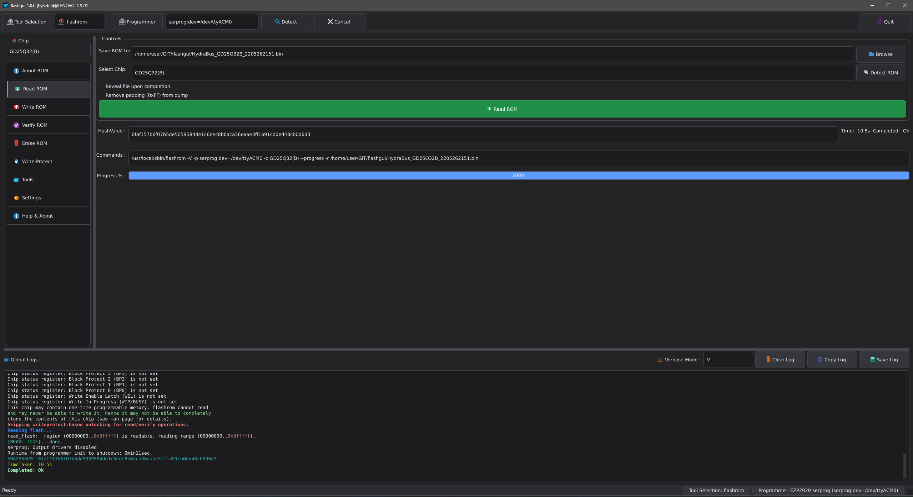

# flashgui

Desktop GUI for `flashrom` and `flashprog`, focused on safer firmware operations and practical chip/datasheet workflows.

This repository currently ships as a Python desktop app (`flashgui.py`) with a Qt UI and a Tk fallback path.

## What it does

- Detects and uses either `flashrom` or `flashprog`
- Helps with programmer/chip probing and operation setup
- Supports safer workflows (backup-first habits, explicit write actions, status logging)
- Includes datasheet resolution helpers (including handling ambiguous chip-ID matches)

## Screenshots

### Main workspace

### Toolbar and control flow

### Read flow examples

### Chip information and status pages

### Verify / Erase / Write flow examples

### Programmer console

## Quick start

1. Install Python 3.10+
1. Create a virtual environment:

- `python3 -m venv .venv`

1. Activate the virtual environment:

- Linux/macOS: `source .venv/bin/activate`
- Windows (PowerShell): `.venv\Scripts\Activate.ps1`

1. Install dependencies:

- `python3 -m pip install -r requirements.txt`

1. Run:

- `python3 flashgui.py`

If PySide6/Qt startup fails on Linux, the app will attempt a Tk fallback (`flashgui_legacy.py`).

## Usage

- Launch the app:
  - `python3 flashgui.py`
- Select tool/programmer, detect chip, then perform read/verify/write operations from the GUI.
- Keep `resources/` next to the executable/script so icons, datasheets, and optional tool bundles resolve correctly.

Settings persistence:

- Settings are stored in a per-user config file (not next to the executable).
  - Windows: `%APPDATA%/FlashGUI/flashgui_settings.json`
  - Linux: `$XDG_CONFIG_HOME/flashgui/flashgui_settings.json` (or `~/.config/flashgui/flashgui_settings.json`)
  - macOS: `~/Library/Application Support/flashgui/flashgui_settings.json`
- Optional override: set `FLASHGUI_SETTINGS_PATH` to use a custom settings file path.

## Development notes

- Use Python 3.10+ (CPython 3.10–3.13 recommended).
- If dependency installation fails, verify the Python interpreter/version first.
- For local checks, you can run `pytest` after installing development/build dependencies from `requirements-build.txt`.

## License

📜 License
MIT License — see `LICENSE` for details.

## Repository layout

- `flashgui.py` — main application entrypoint (Qt-first)
- `flashgui_legacy.py` — fallback/legacy UI path
- `flashgui_settings.json` — persisted UI/runtime settings
- `resources/`
  - `chips/` — chip metadata and hint maps
  - `datasheets/` — local datasheet cache
  - `icons/` — application icons
  - `tools/` — optional bundled tool binaries (`flashrom` / `flashprog`)
- `MANUAL_QA_CHECKLIST.md` — manual QA checklist used for release sanity checks

## Publishing / release notes

- Ensure acknowledgements and upstream links remain intact (see below).
- If distributing bundled third-party binaries, include their required license notices in your release artifacts.
- Use `THIRD_PARTY_NOTICES.md` as your release checklist and attribution baseline.
- Validate your release build with the checklist in `MANUAL_QA_CHECKLIST.md`.

Build/publish one-file executable with icon:

- `python -m PyInstaller --name=flashgui --onefile --icon=resources\icons\flashgui.ico flashgui.py`
- `python -m PyInstaller --name=flashgui --onefile --icon=resources/icons/flashgui.ico flashgui.py`

Release bundle generated in this repo:

- `release/flashgui-v1.1.0-windows-x64.zip`

GitHub publish flow (tag-based):

- Commit release changes (version bump, docs, screenshots)
- Create an annotated tag (example: `v1.1.0`)
- Push branch and tag to `origin`
- Create a GitHub Release from tag `v1.1.0` and upload `release/flashgui-v1.1.0-windows-x64.zip`

## Mentions & thanks

Big thanks to the open-source projects and documentation that made this app possible:

- [`flashrom/flashrom`](https://github.com/flashrom/flashrom) — core flashing engine and broad hardware support.
- [`SourceArcade/flashprog`](https://github.com/SourceArcade/flashprog) — actively maintained flashprog ecosystem.
- [`Jazzzny/iFR`](https://github.com/Jazzzny/iFR) — useful early Python GUI reference.
- [`KantBStoppd/FlashromGUI`](https://github.com/KantBStoppd/FlashromGUI) — community GUI project with safety/usability focus.

Helpful official docs we rely on and recommend:

- [flashrom classic CLI manpage](https://www.flashrom.org/classic_cli_manpage.html)
- [FT2232 SPI programmer notes](https://www.flashrom.org/supported_hw/supported_prog/ft2232_spi.html)
- [In-system programming guidance](https://www.flashrom.org/user_docs/in_system.html)

Also worth a look from the "flashrom gui" ecosystem search:

- [`RestlessGoose/QuickFlash`](https://github.com/RestlessGoose/QuickFlash) (archived)

> This project is an independent frontend and is not affiliated with or endorsed by the `flashrom` or `flashprog` maintainers.
