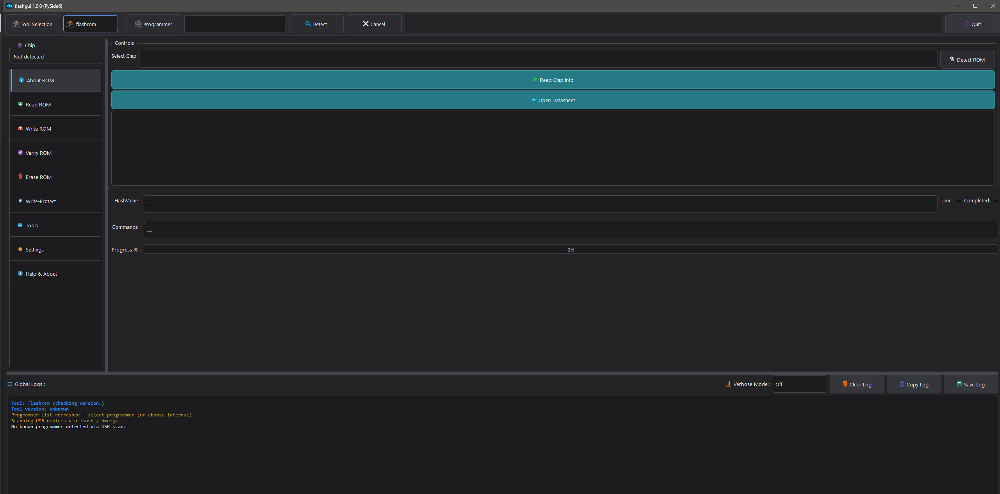
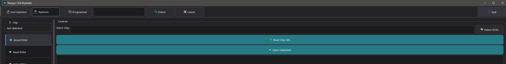
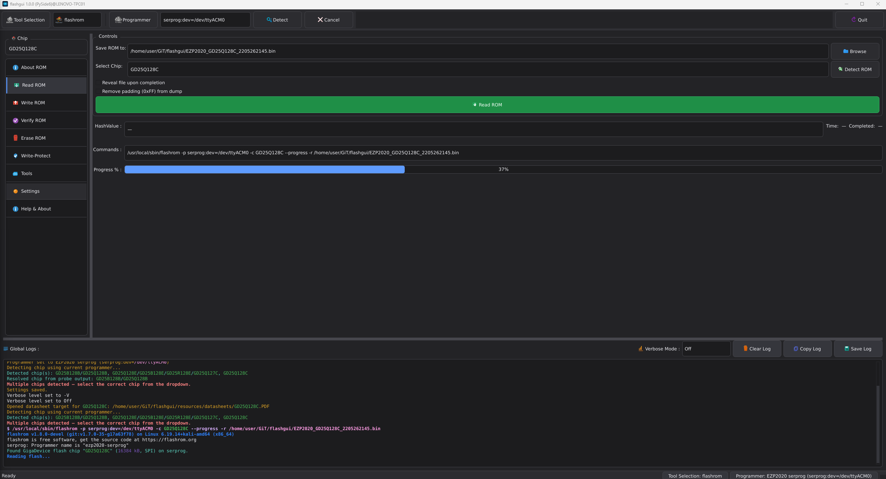
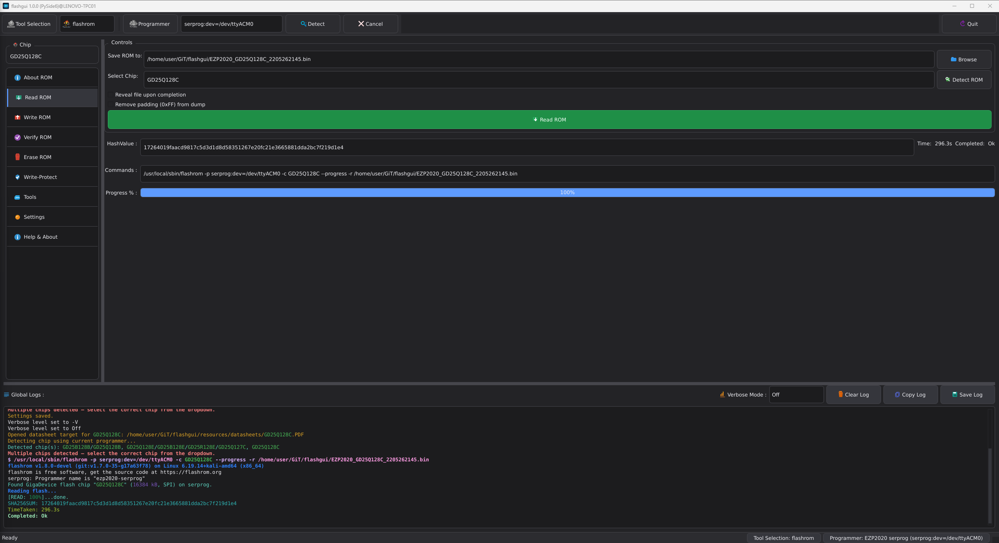
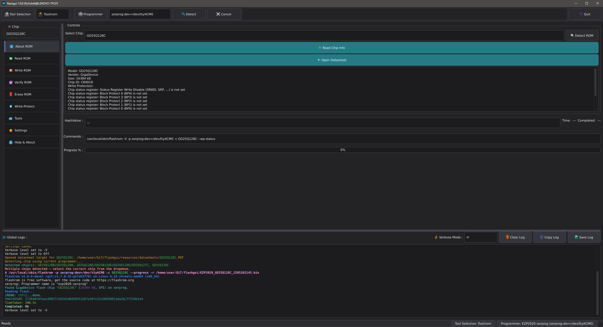
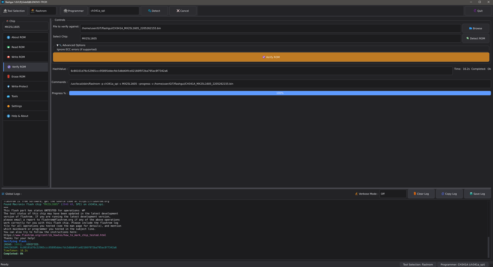
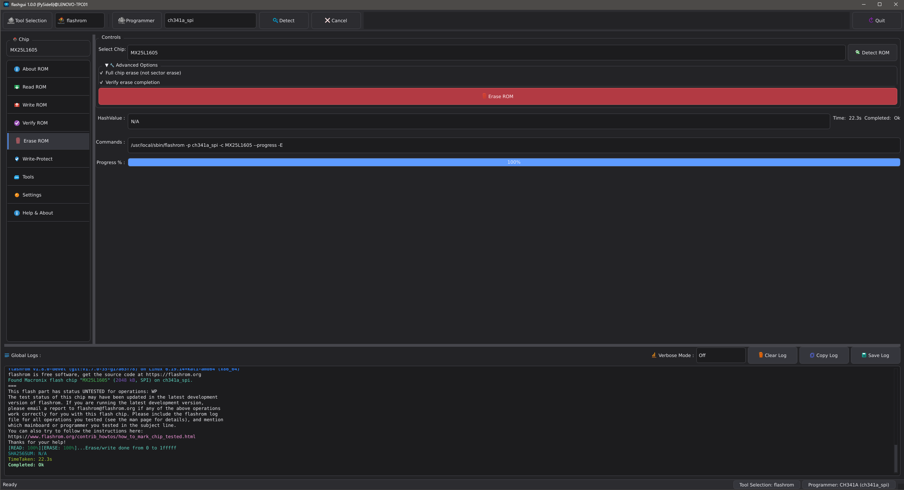
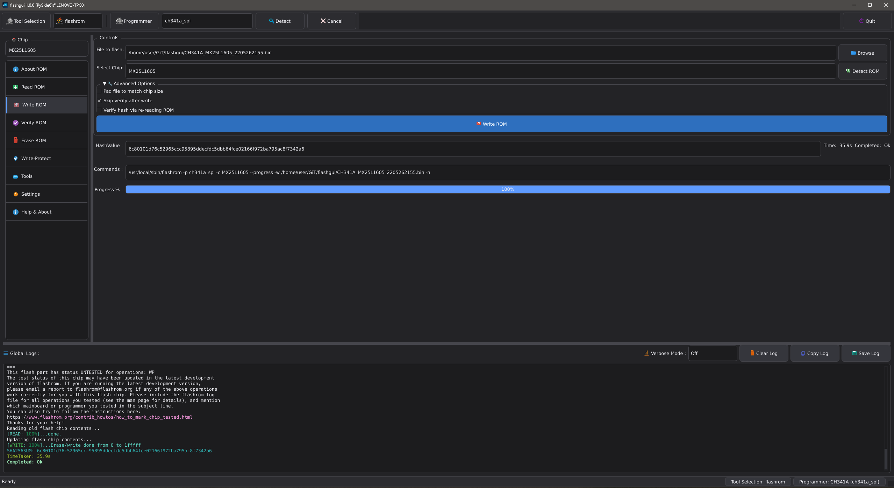

# flashgui

Desktop GUI for `flashrom` and `flashprog`, focused on safer firmware operations and practical chip/datasheet workflows.

This repository currently ships as a Python desktop app (`flashgui.py`) with a Qt UI and a Tk fallback path.

## What it does

- Detects and uses either `flashrom` or `flashprog`
- Helps with programmer/chip probing and operation setup
- Supports safer workflows (backup-first habits, explicit write actions, status logging)
- Includes datasheet resolution helpers (including handling ambiguous chip-ID matches)

## Screenshots

### Main workspace

### Toolbar and control flow

### Additional operation captures

## Quick start

1. Install Python 3.10+
2. Install dependencies from `requirements.txt`
3. Run:
   - `python flashgui.py`

If PySide6/Qt startup fails on Linux, the app will attempt a Tk fallback (`flashgui_legacy.py`).

## Usage

- Launch the app:
  - Windows: `python flashgui.py`
  - Linux/macOS: `python3 flashgui.py`
- Select tool/programmer, detect chip, then perform read/verify/write operations from the GUI.
- Keep `resources/` next to the executable/script so icons, datasheets, and optional tool bundles resolve correctly.

Settings persistence:

- Settings are stored in a per-user config file (not next to the executable).
  - Windows: `%APPDATA%/FlashGUI/flashgui_settings.json`
  - Linux: `$XDG_CONFIG_HOME/flashgui/flashgui_settings.json` (or `~/.config/flashgui/flashgui_settings.json`)
  - macOS: `~/Library/Application Support/flashgui/flashgui_settings.json`
- Optional override: set `FLASHGUI_SETTINGS_PATH` to use a custom settings file path.

## Build instructions

Prerequisites (both platforms):

- CPython 3.10-3.13 (3.14 is currently not supported for this project build flow)
- Build dependencies installed:
  - Windows: `pip install -r requirements-build.txt`
  - Linux: `python3 -m pip install -r requirements-build.txt`
- `PySide6` must be importable in the build environment.

If `PySide6` cannot be installed, check your Python distribution/version first (official python.org CPython 3.12 x64 is recommended on Windows).

These build scripts are configured for **PySide6-only packaging**.

### Windows executable (PyInstaller)

- Run: `build_exe.bat`
- Output: `dist/flashgui.exe`

The script installs `pyinstaller` + `wheel`, validates `flashgui.py`, bundles `resources/`, and produces a one-file executable.

Optional: select a specific Windows interpreter before running the build script:

- `set PYTHON_CMD=py -3.12`
- `build_exe.bat`

### Linux executable (PyInstaller)

- Make script executable once: `chmod +x build.sh`
- Run: `./build.sh`
- Output: `dist/flashgui`

The Linux script performs the same validation/build flow and bundles `resources/`.

Notes:

- Shell scripts are tracked with LF endings via `.gitattributes`.
- If the executable bit is lost during copy/checkout, re-apply with `chmod +x build.sh`.

## Repository layout

- `flashgui.py` — main application entrypoint (Qt-first)
- `flashgui_legacy.py` — fallback/legacy UI path
- `flashgui_settings.json` — persisted UI/runtime settings
- `resources/`
  - `chips/` — chip metadata and hint maps
  - `datasheets/` — local datasheet cache
  - `icons/` — application icons
  - `tools/` — optional bundled tool binaries (`flashrom` / `flashprog`)
- `build_exe.bat` — Windows helper script for building an executable
- `build.sh` — Linux helper script for building an executable
- `MANUAL_QA_CHECKLIST.md` — manual QA checklist used for release sanity checks

## Publishing / release notes

- Ensure acknowledgements and upstream links remain intact (see below).
- If distributing bundled third-party binaries, include their required license notices in your release artifacts.
- Use `THIRD_PARTY_NOTICES.md` as your release checklist and attribution baseline.
- Validate your release build with the checklist in `MANUAL_QA_CHECKLIST.md`.

## Mentions & thanks

Big thanks to the open-source projects and documentation that made this app possible:

- [`flashrom/flashrom`](https://github.com/flashrom/flashrom) — core flashing engine and broad hardware support.
- [`SourceArcade/flashprog`](https://github.com/SourceArcade/flashprog) — actively maintained flashprog ecosystem.
- [`Jazzzny/iFR`](https://github.com/Jazzzny/iFR) — useful early Python GUI reference.
- [`KantBStoppd/FlashromGUI`](https://github.com/KantBStoppd/FlashromGUI) — community GUI project with safety/usability focus.

Helpful official docs we rely on and recommend:

- [flashrom classic CLI manpage](https://www.flashrom.org/classic_cli_manpage.html)
- [FT2232 SPI programmer notes](https://www.flashrom.org/supported_hw/supported_prog/ft2232_spi.html)
- [In-system programming guidance](https://www.flashrom.org/user_docs/in_system.html)

Also worth a look from the "flashrom gui" ecosystem search:

- [`RestlessGoose/QuickFlash`](https://github.com/RestlessGoose/QuickFlash) (archived)

> This project is an independent frontend and is not affiliated with or endorsed by the `flashrom` or `flashprog` maintainers.
